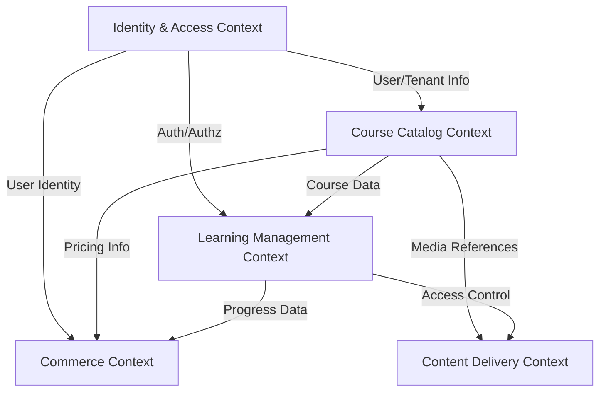

# Educational Marketplace Platform Architecture

## Executive Summary

Multi-tenant educational marketplace platform enabling instructors to create and sell courses while providing learners with a comprehensive catalog of educational content. The system supports multiple organizations (tenants) with complete data isolation, persona-based user experiences, and scalable catalog management.

## Domain Model & Bounded Contexts

### Core Bounded Contexts

#### 1. **Identity & Access Context**
- **Purpose**: User authentication, authorization, and multi-tenancy
- **Aggregates**:
  - User (root): Profile, credentials, tenant associations
  - Tenant (root): Organization settings, branding, limits
  - Role: Permissions, persona mappings
- **Value Objects**: Email, TenantId, UserId, PersonaType

#### 2. **Course Catalog Context**
- **Purpose**: Course creation, management, and discovery
- **Aggregates**:
  - Course (root): Metadata, pricing, enrollment rules
  - Module: Lessons, assessments, resources
  - Category: Taxonomy, navigation structure
- **Value Objects**: CourseId, Price, Duration, SkillLevel

#### 3. **Learning Management Context**
- **Purpose**: Student progress, assessments, certifications
- **Aggregates**:
  - Enrollment (root): Student-course relationship
  - Progress: Completion tracking, scores
  - Certificate: Achievements, credentials
- **Value Objects**: EnrollmentId, Score, CompletionStatus

#### 4. **Commerce Context**
- **Purpose**: Payments, subscriptions, revenue sharing
- **Aggregates**:
  - Order (root): Purchase transactions
  - Subscription: Recurring payments, access control
  - Payout: Instructor earnings, platform fees
- **Value Objects**: OrderId, Amount, PaymentMethod, Fee

#### 5. **Content Delivery Context**
- **Purpose**: Video streaming, file storage, CDN integration
- **Aggregates**:
  - Media (root): Videos, documents, assets
  - StreamingSession: Playback tracking, quality adaptation
- **Value Objects**: MediaId, Format, Resolution, Bitrate

### Context Mapping



## Multi-Tenant Architecture

### Tenant Isolation Strategy

#### Database Level: Hybrid Approach
- **Shared Database, Separate Schemas**: Primary strategy
- **Row-Level Security**: Additional protection via tenant_id
- **Separate Databases**: For enterprise clients requiring complete isolation

```sql
-- Example: Row-level security policy
CREATE POLICY tenant_isolation ON courses
    FOR ALL TO application_role
    USING (tenant_id = current_setting('app.current_tenant')::uuid);
```

### Tenant Identification
- **Subdomain-based**: `acme.edmarketplace.com`
- **Header-based**: `X-Tenant-ID` for API clients
- **JWT Claims**: Embedded tenant context in tokens

### Tenant Configuration
```typescript
interface TenantConfig {
  id: string;
  subdomain: string;
  features: {
    maxCourses: number;
    maxStudents: number;
    customBranding: boolean;
    whiteLabel: boolean;
    apiAccess: boolean;
  };
  branding: {
    logo: string;
    primaryColor: string;
    customDomain?: string;
  };
  billing: {
    plan: 'starter' | 'professional' | 'enterprise';
    platformFeePercentage: number;
  };
}
```

## Catalog System Design

### Course Hierarchy
```typescript
interface Course {
  id: string;
  tenantId: string;
  instructorId: string;
  title: string;
  description: string;
  categories: Category[];
  tags: string[];
  pricing: {
    model: 'free' | 'one-time' | 'subscription';
    amount?: number;
    currency: string;
    discounts?: Discount[];
  };
  metadata: {
    duration: number;
    skillLevel: 'beginner' | 'intermediate' | 'advanced';
    language: string;
    prerequisites: string[];
  };
  modules: Module[];
  ratings: RatingsSummary;
  enrollmentCount: number;
  status: 'draft' | 'published' | 'archived';
}

interface Module {
  id: string;
  title: string;
  order: number;
  lessons: Lesson[];
  assessments: Assessment[];
  resources: Resource[];
}
```

### Search & Discovery
- **Elasticsearch Integration**: Full-text search, faceted filtering
- **Recommendation Engine**: ML-based personalization
- **Category Navigation**: Hierarchical taxonomy with breadcrumbs

### Catalog Management APIs
```yaml
/api/v1/catalog:
  /courses:
    get: # Search and filter courses
    post: # Create new course (instructor)
  /courses/{courseId}:
    get: # Get course details
    put: # Update course
    delete: # Archive course
  /categories:
    get: # List all categories
  /recommendations:
    get: # Get personalized recommendations
```

## Persona Architecture

### User Personas

#### 1. **Learner Persona**
```typescript
interface LearnerPersona {
  type: 'learner';
  preferences: {
    learningStyle: 'visual' | 'auditory' | 'kinesthetic';
    pace: 'self-paced' | 'cohort-based';
    interests: string[];
  };
  capabilities: [
    'browse_catalog',
    'enroll_courses',
    'track_progress',
    'earn_certificates',
    'join_discussions',
    'rate_courses'
  ];
  dashboard: {
    widgets: ['current_courses', 'progress_tracker', 'recommendations', 'achievements'];
    layout: 'learner_focused';
  };
}
```

#### 2. **Instructor Persona**
```typescript
interface InstructorPersona {
  type: 'instructor';
  expertise: {
    subjects: string[];
    teachingExperience: number;
    certifications: Certification[];
  };
  capabilities: [
    'create_courses',
    'manage_content',
    'view_analytics',
    'engage_students',
    'manage_payouts',
    'create_assessments'
  ];
  dashboard: {
    widgets: ['course_performance', 'student_engagement', 'revenue_analytics', 'content_calendar'];
    layout: 'instructor_focused';
  };
}
```

#### 3. **Admin Persona**
```typescript
interface AdminPersona {
  type: 'admin';
  scope: 'platform' | 'tenant';
  capabilities: [
    'manage_users',
    'configure_tenant',
    'view_platform_analytics',
    'moderate_content',
    'manage_categories',
    'configure_payments'
  ];
  dashboard: {
    widgets: ['platform_metrics', 'user_management', 'content_moderation', 'financial_overview'];
    layout: 'admin_focused';
  };
}
```

### Persona-Based UI/UX
- **Dynamic Navigation**: Menu items based on persona
- **Contextual Actions**: Role-specific CTAs
- **Adaptive Dashboards**: Persona-optimized layouts
- **Permission-Based Rendering**: Component visibility control

## API Design

### RESTful API Structure
```yaml
openapi: 3.0.0
info:
  title: Educational Marketplace API
  version: 1.0.0

paths:
  # Authentication & Users
  /api/v1/auth/login:
    post:
      summary: Authenticate user
      requestBody:
        content:
          application/json:
            schema:
              type: object
              properties:
                email: { type: string }
                password: { type: string }
                tenantId: { type: string }
  
  # Course Management
  /api/v1/courses:
    get:
      summary: List courses
      parameters:
        - name: category
          in: query
          schema: { type: string }
        - name: instructor
          in: query
          schema: { type: string }
        - name: price_range
          in: query
          schema: { type: string }
      security:
        - bearerAuth: []
    
    post:
      summary: Create course
      security:
        - bearerAuth: []
        - instructorRole: []
  
  # Enrollments
  /api/v1/enrollments:
    post:
      summary: Enroll in course
      requestBody:
        content:
          application/json:
            schema:
              type: object
              properties:
                courseId: { type: string }
                paymentMethodId: { type: string }
  
  # Progress Tracking
  /api/v1/progress/{enrollmentId}:
    get:
      summary: Get learning progress
    patch:
      summary: Update progress
```

### GraphQL Alternative
```graphql
type Query {
  # Course catalog
  courses(
    filter: CourseFilter
    pagination: PaginationInput
  ): CourseConnection!
  
  # User-specific queries
  myEnrollments: [Enrollment!]!
  myProgress(courseId: ID!): Progress
  
  # Instructor queries
  myCourses: [Course!]! @hasRole(role: INSTRUCTOR)
  courseAnalytics(courseId: ID!): Analytics @hasRole(role: INSTRUCTOR)
}

type Mutation {
  # Course management
  createCourse(input: CreateCourseInput!): Course! @hasRole(role: INSTRUCTOR)
  updateCourse(id: ID!, input: UpdateCourseInput!): Course! @hasRole(role: INSTRUCTOR)
  
  # Enrollment
  enrollInCourse(courseId: ID!, paymentMethod: PaymentMethodInput): Enrollment!
  
  # Progress
  markLessonComplete(lessonId: ID!): Progress!
}
```

## Database Schema

### Core Tables (PostgreSQL)
```sql
-- Multi-tenant foundation
CREATE TABLE tenants (
    id UUID PRIMARY KEY DEFAULT gen_random_uuid(),
    subdomain VARCHAR(63) UNIQUE NOT NULL,
    name VARCHAR(255) NOT NULL,
    settings JSONB DEFAULT '{}',
    created_at TIMESTAMP DEFAULT CURRENT_TIMESTAMP
);

-- Users with tenant association
CREATE TABLE users (
    id UUID PRIMARY KEY DEFAULT gen_random_uuid(),
    email VARCHAR(255) NOT NULL,
    tenant_id UUID REFERENCES tenants(id),
    persona_type VARCHAR(50) NOT NULL,
    profile JSONB DEFAULT '{}',
    UNIQUE(email, tenant_id)
);

-- Course catalog
CREATE TABLE courses (
    id UUID PRIMARY KEY DEFAULT gen_random_uuid(),
    tenant_id UUID REFERENCES tenants(id),
    instructor_id UUID REFERENCES users(id),
    title VARCHAR(255) NOT NULL,
    slug VARCHAR(255) NOT NULL,
    description TEXT,
    metadata JSONB DEFAULT '{}',
    pricing JSONB NOT NULL,
    status VARCHAR(50) DEFAULT 'draft',
    created_at TIMESTAMP DEFAULT CURRENT_TIMESTAMP,
    UNIQUE(tenant_id, slug)
);

-- Enrollments with progress tracking
CREATE TABLE enrollments (
    id UUID PRIMARY KEY DEFAULT gen_random_uuid(),
    tenant_id UUID REFERENCES tenants(id),
    student_id UUID REFERENCES users(id),
    course_id UUID REFERENCES courses(id),
    enrolled_at TIMESTAMP DEFAULT CURRENT_TIMESTAMP,
    progress JSONB DEFAULT '{}',
    completion_percentage INTEGER DEFAULT 0,
    UNIQUE(student_id, course_id)
);

-- Indexes for performance
CREATE INDEX idx_courses_tenant_status ON courses(tenant_id, status);
CREATE INDEX idx_enrollments_student ON enrollments(student_id);
CREATE INDEX idx_courses_search ON courses USING gin(to_tsvector('english', title || ' ' || description));
```

## Authentication & Authorization

### JWT-Based Auth with Tenant Context
```typescript
interface JWTPayload {
  sub: string; // user id
  email: string;
  tenantId: string;
  persona: PersonaType;
  permissions: string[];
  exp: number;
}
```

### Permission Model
```typescript
const permissionMatrix = {
  learner: [
    'catalog:read',
    'course:enroll',
    'progress:read',
    'progress:update:own',
    'certificate:read:own'
  ],
  instructor: [
    ...learnerPermissions,
    'course:create',
    'course:update:own',
    'course:delete:own',
    'analytics:read:own',
    'payout:read:own'
  ],
  admin: [
    '*:*' // Full access within tenant
  ]
};
```

### OAuth2 Integration
- **Social Login**: Google, GitHub, LinkedIn
- **SSO**: SAML 2.0 for enterprise tenants
- **API Keys**: For programmatic access

## Payment & Billing Integration

### Payment Processing
```typescript
interface PaymentProcessor {
  // Stripe integration
  async processPayment(order: Order): Promise<PaymentResult>;
  
  // Subscription management
  async createSubscription(plan: SubscriptionPlan): Promise<Subscription>;
  
  // Revenue sharing
  async calculatePayout(instructorId: string, period: Period): Promise<Payout>;
}
```

### Revenue Model
- **Platform Fee**: 10-20% per transaction
- **Subscription Tiers**: For tenants
- **Instructor Payouts**: Monthly with minimum threshold

## Technical Architecture

### Microservices Design
```yaml
services:
  api-gateway:
    tech: Node.js + Express
    responsibilities:
      - Request routing
      - Rate limiting
      - Authentication
  
  catalog-service:
    tech: Node.js + PostgreSQL
    responsibilities:
      - Course CRUD
      - Search & filtering
      - Category management
  
  learning-service:
    tech: Python + PostgreSQL
    responsibilities:
      - Progress tracking
      - Assessment grading
      - Certificate generation
  
  payment-service:
    tech: Node.js + Stripe
    responsibilities:
      - Payment processing
      - Subscription management
      - Revenue calculations
  
  media-service:
    tech: Go + S3 + CloudFront
    responsibilities:
      - Video upload/processing
      - CDN management
      - Streaming optimization
```

### Infrastructure
```yaml
production:
  kubernetes:
    clusters:
      - region: us-east-1
        nodes: 10-50 (auto-scaling)
    
  databases:
    primary: AWS RDS PostgreSQL (Multi-AZ)
    cache: Redis Cluster
    search: Elasticsearch Cluster
  
  storage:
    media: S3 + CloudFront
    backups: S3 with lifecycle policies
  
  monitoring:
    - Datadog: APM, logs, metrics
    - Sentry: Error tracking
    - Grafana: Custom dashboards
```

## Security Considerations

### Data Protection
- **Encryption**: TLS 1.3 in transit, AES-256 at rest
- **PII Handling**: GDPR/CCPA compliance
- **Secrets Management**: AWS Secrets Manager

### Security Headers
```typescript
const securityHeaders = {
  'Strict-Transport-Security': 'max-age=31536000; includeSubDomains',
  'X-Content-Type-Options': 'nosniff',
  'X-Frame-Options': 'DENY',
  'X-XSS-Protection': '1; mode=block',
  'Content-Security-Policy': "default-src 'self'; script-src 'self' 'unsafe-inline' cdn.trusted.com"
};
```

## Scalability & Performance

### Caching Strategy
- **CDN**: Static assets, course thumbnails
- **Redis**: Session data, frequently accessed courses
- **Database**: Query result caching

### Performance Targets
- **API Response Time**: < 200ms (p95)
- **Page Load Time**: < 2s (p90)
- **Video Start Time**: < 3s
- **Concurrent Users**: 100k per tenant

## Monitoring & Analytics

### Key Metrics
```typescript
interface PlatformMetrics {
  business: {
    totalRevenue: number;
    activeUsers: number;
    courseCompletionRate: number;
    averageRating: number;
  };
  technical: {
    apiLatency: LatencyMetrics;
    errorRate: number;
    dbConnectionPool: PoolMetrics;
    cdnHitRate: number;
  };
  perTenant: TenantMetrics[];
}
```

## Development Roadmap

### Phase 1: MVP (3 months)
- Basic multi-tenancy
- Course creation/enrollment
- Simple payment processing
- Video streaming

### Phase 2: Enhancement (3 months)
- Advanced search
- Persona-based dashboards
- Analytics & reporting
- Mobile apps

### Phase 3: Scale (6 months)
- ML recommendations
- Live streaming
- Advanced assessments
- White-label solution
- API marketplace

## Conclusion

This architecture provides a scalable, secure, and feature-rich foundation for a multi-tenant educational marketplace. The design emphasizes modularity, tenant isolation, and persona-based experiences while maintaining performance and developer productivity.