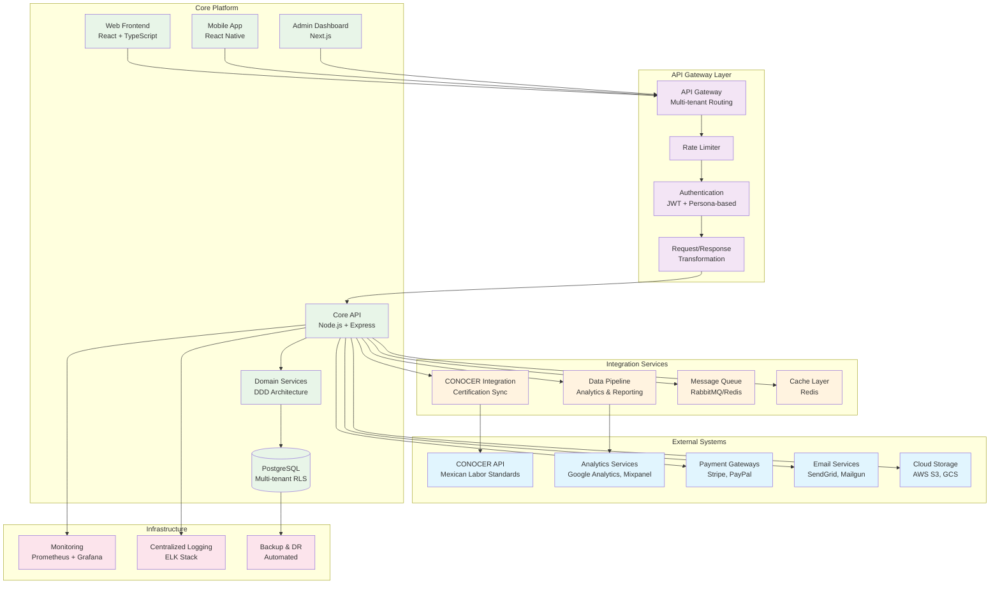
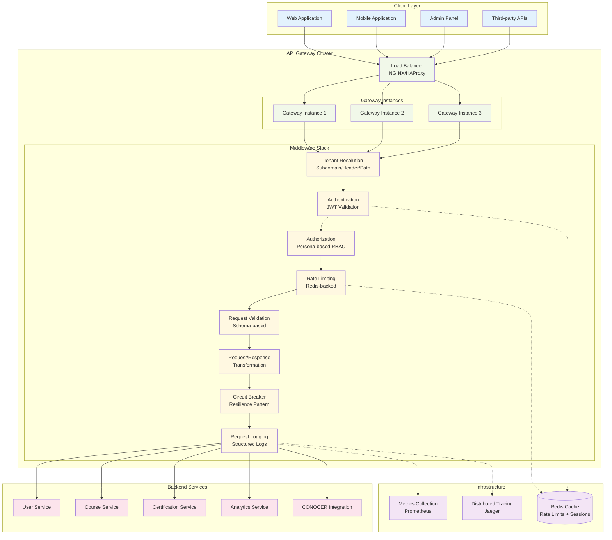
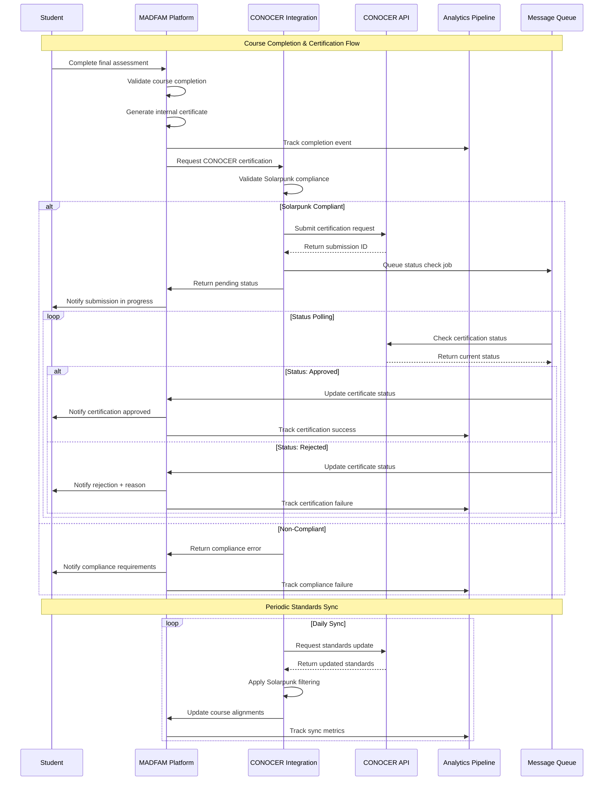
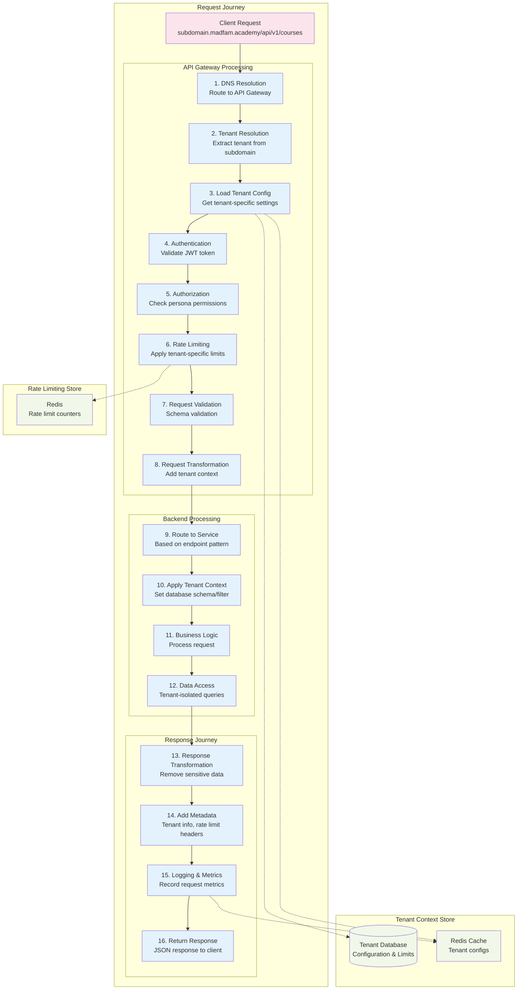
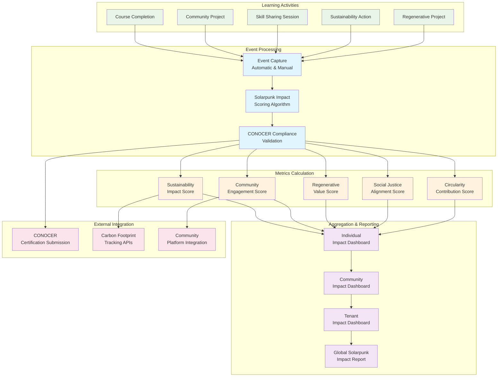
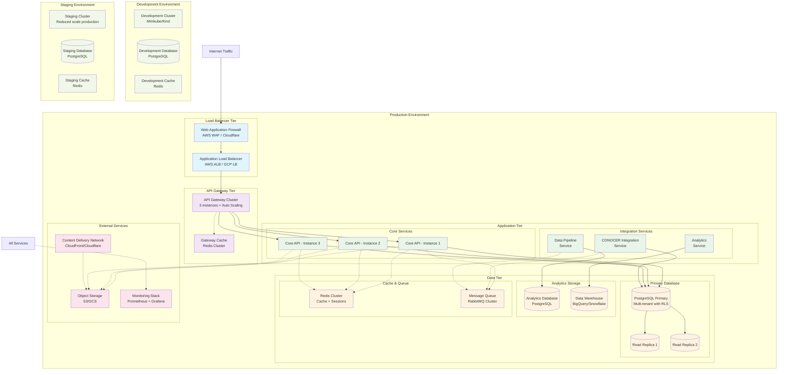

# Integration Layer Architecture Diagrams
## MADFAM Academy Marketplace Platform

### System Overview Diagram

### API Gateway Architecture

### CONOCER Integration Flow

### Data Pipeline Architecture

```mermaid
graph TD
    subgraph "Data Sources"
        UserEvents[User Interaction Events]
        LearningEvents[Learning Progress Events]
        SolarpunkEvents[Solarpunk Impact Events]
        SystemEvents[System Performance Events]
        ExternalData[External Data Sources]
    end

    subgraph "Event Ingestion Layer"
        EventAPI[Event Ingestion API]
        EventBuffer[Event Buffer<br/>Redis Streams]
        EventValidator[Event Validation<br/>Schema Enforcement]
    end

    subgraph "Stream Processing"
        KafkaCluster[Apache Kafka<br/>Event Streaming]
        
        subgraph "Real-time Processors"
            LearningProcessor[Learning Analytics<br/>Processor]
            EngagementProcessor[Engagement Metrics<br/>Processor]
            SolarpunkProcessor[Solarpunk Impact<br/>Processor]
            AlertProcessor[Real-time Alerts<br/>Processor]
        end
    end

    subgraph "Batch Processing"
        Scheduler[Apache Airflow<br/>Workflow Orchestration]
        
        subgraph "Batch Jobs"
            DailyAggregation[Daily Aggregation<br/>Job]
            WeeklyReports[Weekly Reports<br/>Generation]
            MonthlyMetrics[Monthly Solarpunk<br/>Impact Reports]
            DataWarehouseETL[Data Warehouse<br/>ETL Job]
        end
    end

    subgraph "Storage Layer"
        AnalyticsDB[(Analytics Database<br/>PostgreSQL)]
        DataWarehouse[(Data Warehouse<br/>Snowflake/BigQuery)]
        CacheLayer[Cache Layer<br/>Redis]
        FileStorage[File Storage<br/>S3/GCS]
    end

    subgraph "Analytics & Reporting"
        Dashboard[Real-time Dashboard<br/>Grafana]
        ReportingAPI[Reporting API<br/>GraphQL]
        ExportService[Data Export<br/>Service]
        MLPipeline[ML Pipeline<br/>Predictive Analytics]
    end

    subgraph "Monitoring & Observability"
        MetricsCollector[Metrics Collection<br/>Prometheus]
        LogAggregator[Log Aggregation<br/>ELK Stack]
        AlertManager[Alert Manager<br/>PagerDuty Integration]
    end

    %% Data flow
    UserEvents --> EventAPI
    LearningEvents --> EventAPI
    SolarpunkEvents --> EventAPI
    SystemEvents --> EventAPI
    ExternalData --> EventAPI

    EventAPI --> EventBuffer
    EventBuffer --> EventValidator
    EventValidator --> KafkaCluster

    %% Real-time processing
    KafkaCluster --> LearningProcessor
    KafkaCluster --> EngagementProcessor
    KafkaCluster --> SolarpunkProcessor
    KafkaCluster --> AlertProcessor

    LearningProcessor --> AnalyticsDB
    EngagementProcessor --> AnalyticsDB
    SolarpunkProcessor --> AnalyticsDB
    AlertProcessor --> AlertManager

    %% Batch processing
    Scheduler --> DailyAggregation
    Scheduler --> WeeklyReports
    Scheduler --> MonthlyMetrics
    Scheduler --> DataWarehouseETL

    DailyAggregation --> AnalyticsDB
    WeeklyReports --> FileStorage
    MonthlyMetrics --> FileStorage
    DataWarehouseETL --> DataWarehouse

    %% Storage connections
    AnalyticsDB --> CacheLayer
    DataWarehouse --> ReportingAPI

    %% Analytics & Reporting
    AnalyticsDB --> Dashboard
    AnalyticsDB --> ReportingAPI
    DataWarehouse --> ExportService
    DataWarehouse --> MLPipeline

    %% Monitoring
    KafkaCluster -.-> MetricsCollector
    AnalyticsDB -.-> MetricsCollector
    EventAPI -.-> LogAggregator
    Scheduler -.-> LogAggregator

    classDef source fill:#e8f5e8
    classDef ingestion fill:#e1f5fe
    classDef processing fill:#fff3e0
    classDef storage fill:#f3e5f5
    classDef analytics fill:#fce4ec
    classDef monitoring fill:#f1f8e9

    class UserEvents,LearningEvents,SolarpunkEvents,SystemEvents,ExternalData source
    class EventAPI,EventBuffer,EventValidator ingestion
    class KafkaCluster,LearningProcessor,EngagementProcessor,SolarpunkProcessor,AlertProcessor,Scheduler,DailyAggregation,WeeklyReports,MonthlyMetrics,DataWarehouseETL processing
    class AnalyticsDB,DataWarehouse,CacheLayer,FileStorage storage
    class Dashboard,ReportingAPI,ExportService,MLPipeline analytics
    class MetricsCollector,LogAggregator,AlertManager monitoring
```

### Multi-Tenant Request Flow

### Solarpunk Impact Tracking Flow

### Infrastructure Deployment Architecture

These diagrams provide a comprehensive view of the MADFAM Academy integration layer architecture, showing the relationships between components, data flows, and deployment strategies. The architecture emphasizes scalability, resilience, and the unique Solarpunk educational mission of the platform.