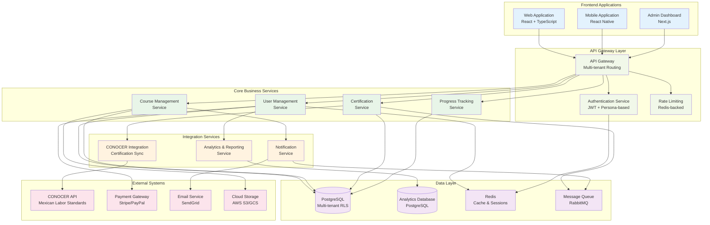
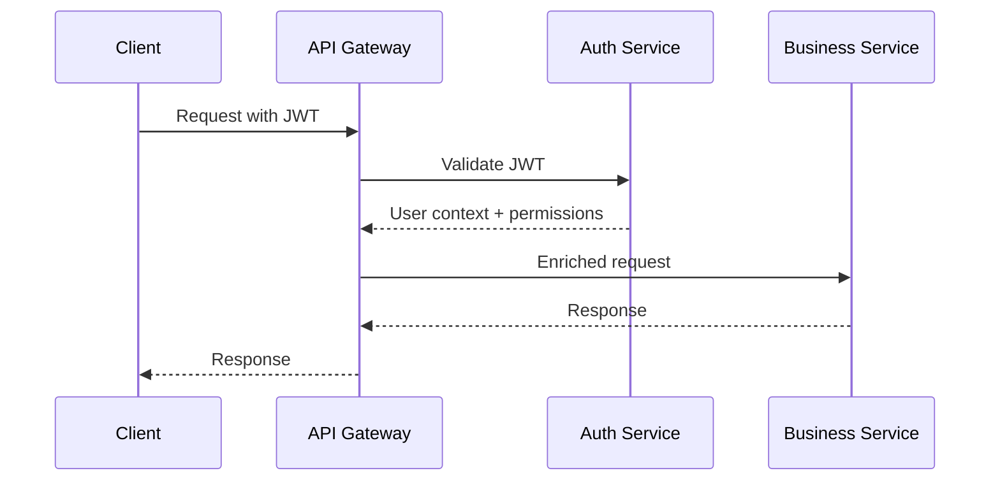
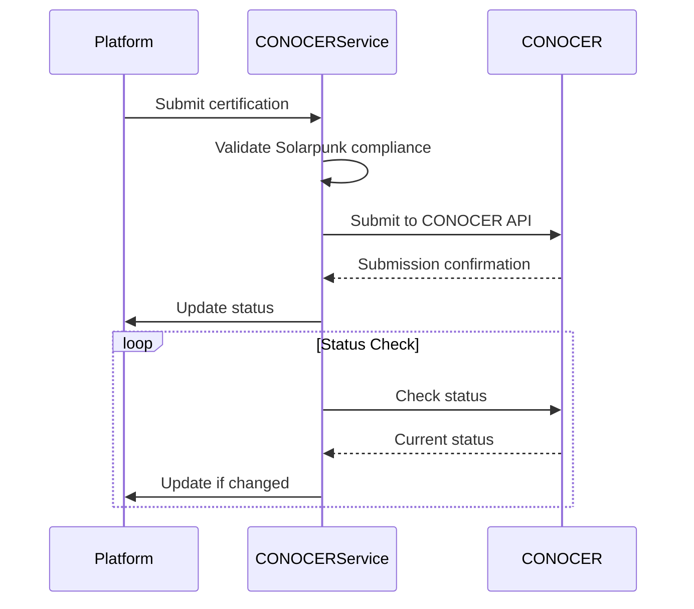
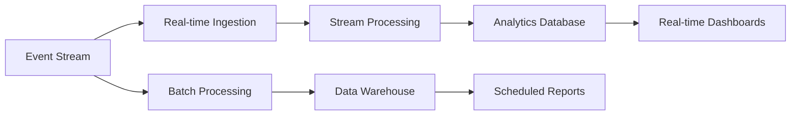

# MADFAM Academy Technical Architecture Specification
**Version 1.0** | **Date: 2024-07-10** | **Status: Active Development**

## Executive Summary

MADFAM Academy is a multi-tenant educational marketplace platform designed to revolutionize skills-based learning through the integration of CONOCER (Mexican labor competency standards) certification and Solarpunk educational principles. The platform enables instructors to create and sell courses while providing learners with pathways to officially recognized certifications that align with sustainable, regenerative, and socially just practices.

### Key Architecture Principles

1. **Domain-Driven Design (DDD)**: Clear separation of business domains with well-defined bounded contexts
2. **Multi-Tenancy**: Complete tenant isolation with configurable features and limits
3. **Solarpunk Integration**: Sustainability metrics and regenerative education tracking
4. **Event-Driven Architecture**: Loosely coupled services communicating through domain events
5. **Microservices Pattern**: Scalable, maintainable service boundaries
6. **API-First Design**: Comprehensive REST APIs with OpenAPI specifications

## System Overview



## Architecture Layers

### 1. Frontend Layer

#### Web Application (React + TypeScript)
- **Framework**: React 18.2 with TypeScript for type safety
- **State Management**: Zustand for global state, TanStack Query for server state
- **Styling**: TailwindCSS with PostCSS for utility-first styling
- **Routing**: React Router v6 for client-side routing
- **Build Tool**: Vite for fast development and optimized builds

**Key Features**:
- Server-side rendering support
- Progressive Web App (PWA) capabilities
- Real-time updates via WebSocket connections
- Accessibility compliance (WCAG 2.1 AA)
- Multi-language support (i18n)

#### Mobile Application (React Native)
- **Framework**: React Native with TypeScript
- **Navigation**: React Navigation v6
- **State Management**: Shared with web application
- **Platform Integration**: Native device features integration

#### Admin Dashboard (Next.js)
- **Framework**: Next.js with TypeScript
- **Features**: Server-side rendering, static generation
- **Authentication**: Admin-specific authentication flows
- **Analytics**: Built-in analytics dashboard

### 2. API Gateway Layer

#### Multi-Tenant API Gateway
The API Gateway serves as the single entry point for all client requests, providing:

**Core Responsibilities**:
- **Tenant Resolution**: Extract tenant context from subdomain, header, or path
- **Authentication**: JWT token validation and user context injection
- **Authorization**: Persona-based access control enforcement
- **Rate Limiting**: Tenant-specific and global rate limiting
- **Request/Response Transformation**: Data format conversions
- **Circuit Breaking**: Fault tolerance for downstream services
- **Logging & Monitoring**: Comprehensive request/response logging

**Tenant Resolution Strategies**:
1. **Subdomain-based**: `tenant.madfam.academy`
2. **Header-based**: `X-Tenant-ID` header
3. **Path-based**: `/api/v1/tenants/{tenantId}/...`

#### Authentication & Authorization

**Authentication Flow**:


**Persona-Based Authorization**:
- **Learner**: Course browsing, enrollment, progress tracking
- **Instructor**: Course creation, student management, analytics
- **Admin**: Tenant management, user administration
- **Super Admin**: Platform-wide administration

### 3. Core Business Services

#### User Management Service

**Domain Model**:
```typescript
interface User {
  id: UserId;
  tenantId: TenantId;
  email: Email;
  profile: UserProfile;
  persona: Persona;
  preferences: UserPreferences;
  solarpunkProfile: SolarpunkProfile;
}

interface SolarpunkProfile {
  sustainabilityGoals: Goal[];
  communityContributions: Contribution[];
  impactMetrics: ImpactMetric[];
  regenerativeActivities: Activity[];
}
```

**Key Features**:
- Multi-tenant user management
- Persona-based role assignment
- Solarpunk profile and impact tracking
- Social authentication integration
- GDPR compliance and data portability

#### Course Management Service

**Domain Model**:
```typescript
interface Course {
  id: CourseId;
  tenantId: TenantId;
  title: string;
  description: string;
  instructor: InstructorId;
  modules: Module[];
  pricing: PricingModel;
  certification: CertificationInfo;
  solarpunkAlignment: SolarpunkAlignment;
  status: CourseStatus;
}

interface SolarpunkAlignment {
  sustainabilityScore: number;
  communityImpact: ImpactLevel;
  regenerativeElements: RegenerativeElement[];
  socialJusticeAlignment: AlignmentLevel;
}
```

**Key Features**:
- Rich course content management
- Multi-media content support
- Progress tracking and analytics
- Solarpunk compliance validation
- CONOCER standard alignment

#### Certification Service

**Domain Model**:
```typescript
interface Certificate {
  id: CertificateId;
  userId: UserId;
  courseId: CourseId;
  competencyStandardId: CONOCERStandardId;
  issuedAt: Date;
  validUntil: Date;
  status: CertificationStatus;
  verificationHash: string;
  solarpunkCompliance: SolarpunkCompliance;
}
```

**Key Features**:
- Digital certificate generation
- CONOCER integration and submission
- Blockchain-based verification
- Solarpunk compliance scoring
- Certificate portfolio management

### 4. Integration Services

#### CONOCER Integration Service

**Purpose**: Bidirectional synchronization with Mexico's National Council for Standardization and Certification of Labor Competency.

**Key Capabilities**:
- **Standards Synchronization**: Daily sync of competency standards
- **Certification Submission**: Automated submission to CONOCER
- **Status Tracking**: Real-time certification status monitoring
- **Compliance Validation**: Solarpunk alignment verification

**Integration Pattern**:


#### Analytics & Reporting Service

**Purpose**: Real-time and batch analytics processing for learning insights and Solarpunk impact measurement.

**Key Metrics**:
- **Learning Analytics**: Progress, engagement, completion rates
- **Solarpunk Impact**: Sustainability actions, community contributions
- **Business Metrics**: Revenue, user growth, course performance
- **System Metrics**: Performance, reliability, resource utilization

**Data Pipeline Architecture**:


### 5. Data Layer

#### Multi-Tenant Database Architecture

**Strategy**: Hybrid approach combining shared database with Row-Level Security (RLS)

**Core Tables**:
```sql
-- Tenant isolation
CREATE TABLE tenants (
  id UUID PRIMARY KEY,
  name VARCHAR(255) NOT NULL,
  domain VARCHAR(255) UNIQUE,
  settings JSONB,
  created_at TIMESTAMP DEFAULT NOW()
);

-- User management with RLS
CREATE TABLE users (
  id UUID PRIMARY KEY,
  tenant_id UUID REFERENCES tenants(id),
  email VARCHAR(255) NOT NULL,
  profile JSONB,
  created_at TIMESTAMP DEFAULT NOW()
);

-- Enable RLS
ALTER TABLE users ENABLE ROW LEVEL SECURITY;

-- RLS Policy
CREATE POLICY tenant_isolation ON users
  USING (tenant_id = current_setting('app.current_tenant')::UUID);
```

**Database Features**:
- **Row-Level Security**: Complete tenant data isolation
- **JSONB Columns**: Flexible metadata and configuration storage
- **Full-Text Search**: PostgreSQL FTS for course content
- **Audit Logging**: Comprehensive change tracking
- **Performance Optimization**: Strategic indexing and partitioning

#### Caching Strategy

**Redis Usage**:
- **Session Storage**: User sessions and authentication tokens
- **Application Cache**: Frequently accessed data
- **Rate Limiting**: Request rate tracking
- **Real-time Features**: WebSocket session management

**Cache Patterns**:
- **Cache-Aside**: Manual cache management for complex queries
- **Write-Through**: Immediate cache updates for critical data
- **Cache Warming**: Proactive cache population for performance

### 6. Event-Driven Architecture

#### Domain Events

**Event Categories**:
```typescript
// Learning Events
interface CourseEnrolledEvent extends DomainEvent {
  userId: UserId;
  courseId: CourseId;
  enrollmentDate: Date;
  pricingModel: PricingModel;
}

interface LessonCompletedEvent extends DomainEvent {
  userId: UserId;
  courseId: CourseId;
  lessonId: LessonId;
  completionTime: number;
  score?: number;
}

// Solarpunk Events
interface SustainabilityActionEvent extends DomainEvent {
  userId: UserId;
  actionType: SustainabilityActionType;
  impactScore: number;
  description: string;
  verificationData?: VerificationData;
}

interface CommunityContributionEvent extends DomainEvent {
  userId: UserId;
  contributionType: ContributionType;
  beneficiaries: number;
  communityImpact: ImpactLevel;
}
```

#### Event Processing Patterns

**Saga Pattern**: For complex multi-service workflows
```typescript
class CertificationSaga {
  async execute(context: CertificationContext): Promise<void> {
    try {
      await this.validateCompletion(context);
      await this.generateCertificate(context);
      await this.submitToCONOCER(context);
      await this.updateLearnerProfile(context);
      await this.sendNotification(context);
    } catch (error) {
      await this.compensate(context, error);
    }
  }
}
```

**Event Sourcing**: For audit trails and state reconstruction
```typescript
interface EventStore {
  append(streamId: string, events: DomainEvent[]): Promise<void>;
  getEvents(streamId: string, fromVersion?: number): Promise<DomainEvent[]>;
  getSnapshot(streamId: string): Promise<Snapshot | null>;
}
```

## Non-Functional Requirements

### Performance Requirements

**Response Time Targets**:
- **API Endpoints**: < 200ms (95th percentile)
- **Page Load Times**: < 2s (First Contentful Paint)
- **Database Queries**: < 100ms (95th percentile)
- **Real-time Updates**: < 100ms latency

**Throughput Targets**:
- **Concurrent Users**: 10,000+ simultaneous users
- **API Requests**: 1,000+ requests/second
- **Database Connections**: 500+ concurrent connections
- **Event Processing**: 10,000+ events/second

**Scalability**:
- **Horizontal Scaling**: Auto-scaling based on CPU/memory usage
- **Database Scaling**: Read replicas and connection pooling
- **Cache Scaling**: Redis cluster with automatic sharding
- **CDN Integration**: Global content delivery

### Security Requirements

**Authentication & Authorization**:
- **Multi-factor Authentication**: SMS, email, authenticator apps
- **JWT Tokens**: Short-lived access tokens with refresh tokens
- **Role-Based Access Control**: Granular permission system
- **API Security**: Rate limiting, input validation, CORS policies

**Data Protection**:
- **Encryption at Rest**: AES-256 encryption for sensitive data
- **Encryption in Transit**: TLS 1.3 for all communications
- **Data Anonymization**: GDPR-compliant data handling
- **Audit Logging**: Comprehensive security event logging

**Infrastructure Security**:
- **Network Security**: VPC isolation, security groups
- **Container Security**: Image scanning, runtime protection
- **Secrets Management**: HashiCorp Vault or cloud-native solutions
- **Vulnerability Management**: Regular security scans and updates

### Reliability & Availability

**Service Level Objectives (SLOs)**:
- **Availability**: 99.9% uptime (8.76 hours downtime/year)
- **Error Rate**: < 0.1% for critical operations
- **Data Durability**: 99.999999999% (11 9's)
- **Recovery Time**: < 1 hour for critical services

**Fault Tolerance Patterns**:
- **Circuit Breakers**: Prevent cascade failures
- **Bulkheads**: Resource isolation between tenants
- **Retry Logic**: Exponential backoff with jitter
- **Health Checks**: Continuous service monitoring

**Disaster Recovery**:
- **Backup Strategy**: Daily automated backups with point-in-time recovery
- **Geographic Distribution**: Multi-region deployment capability
- **Failover Procedures**: Automated failover for critical services
- **Data Replication**: Real-time data replication across regions

## Technology Stack

### Backend Technologies
- **Runtime**: Node.js 18+ LTS
- **Language**: TypeScript 5.0+ (strict mode)
- **Framework**: Express.js with custom middleware
- **Database**: PostgreSQL 14+ with Row-Level Security
- **Cache**: Redis 7+ with clustering support
- **Message Queue**: RabbitMQ 3.11+ with clustering
- **ORM**: Knex.js for query building and migrations

### Frontend Technologies
- **Framework**: React 18.2+ with TypeScript
- **Build Tool**: Vite 4+ for fast development
- **State Management**: Zustand + TanStack Query
- **Styling**: TailwindCSS 3+ with PostCSS
- **UI Components**: Radix UI + custom components
- **Icons**: Lucide React for consistent iconography

### DevOps & Infrastructure
- **Containerization**: Docker with multi-stage builds
- **Orchestration**: Kubernetes with Helm charts
- **CI/CD**: GitHub Actions with automated testing
- **Monitoring**: Prometheus + Grafana + AlertManager
- **Logging**: ELK Stack (Elasticsearch, Logstash, Kibana)
- **Service Mesh**: Istio for advanced traffic management

### Cloud & External Services
- **Cloud Provider**: AWS, GCP, or Azure (cloud-agnostic design)
- **CDN**: CloudFront, CloudFlare, or Google Cloud CDN
- **Object Storage**: S3, Google Cloud Storage, or Azure Blob
- **Email Service**: SendGrid, Mailgun, or AWS SES
- **Payment Processing**: Stripe, PayPal, or regional providers

## Development Standards

### Code Quality Standards
- **TypeScript**: Strict type checking with no implicit any
- **ESLint**: Comprehensive linting rules with security plugins
- **Prettier**: Consistent code formatting
- **Unit Testing**: 80%+ test coverage with Jest
- **Integration Testing**: End-to-end API testing
- **Performance Testing**: Load testing with k6 or Artillery

### API Design Standards
- **REST Principles**: Resource-based URLs with standard HTTP methods
- **OpenAPI Specification**: Complete API documentation
- **Versioning**: Semantic versioning with backward compatibility
- **Error Handling**: Consistent error response format
- **Rate Limiting**: Tiered rate limits based on user type
- **Caching**: Appropriate cache headers and strategies

### Database Standards
- **Naming Conventions**: snake_case for tables and columns
- **Migration Strategy**: Forward-only migrations with rollback plans
- **Indexing Strategy**: Performance-optimized indexes
- **Data Validation**: Database constraints and application validation
- **Backup Procedures**: Automated daily backups with testing

### Security Standards
- **OWASP Compliance**: Top 10 vulnerability prevention
- **Input Validation**: Comprehensive sanitization and validation
- **SQL Injection Prevention**: Parameterized queries only
- **XSS Prevention**: Content Security Policy and output encoding
- **CSRF Protection**: Token-based CSRF protection
- **Dependency Scanning**: Regular vulnerability scans

## Deployment Architecture

### Environment Strategy
- **Development**: Local development with Docker Compose
- **Staging**: Production-like environment for testing
- **Production**: Multi-region deployment with high availability

### Container Strategy
```dockerfile
# Multi-stage build example
FROM node:18-alpine AS builder
WORKDIR /app
COPY package*.json ./
RUN npm ci --only=production

FROM node:18-alpine AS runtime
RUN addgroup -g 1001 -S nodejs
RUN adduser -S nextjs -u 1001
WORKDIR /app
COPY --from=builder --chown=nextjs:nodejs /app/node_modules ./node_modules
COPY --chown=nextjs:nodejs . .
USER nextjs
EXPOSE 3000
CMD ["npm", "start"]
```

### Kubernetes Deployment
```yaml
apiVersion: apps/v1
kind: Deployment
metadata:
  name: madfam-api
spec:
  replicas: 3
  selector:
    matchLabels:
      app: madfam-api
  template:
    metadata:
      labels:
        app: madfam-api
    spec:
      containers:
      - name: api
        image: madfam/api:latest
        ports:
        - containerPort: 3000
        env:
        - name: DATABASE_URL
          valueFrom:
            secretKeyRef:
              name: database-secret
              key: url
        resources:
          requests:
            memory: "256Mi"
            cpu: "250m"
          limits:
            memory: "512Mi"
            cpu: "500m"
        livenessProbe:
          httpGet:
            path: /health
            port: 3000
          initialDelaySeconds: 30
          periodSeconds: 10
        readinessProbe:
          httpGet:
            path: /ready
            port: 3000
          initialDelaySeconds: 5
          periodSeconds: 5
```

## Monitoring & Observability

### Metrics Collection
```typescript
// Prometheus metrics example
interface ApplicationMetrics {
  httpRequestsTotal: Counter;
  httpRequestDuration: Histogram;
  databaseConnectionsActive: Gauge;
  eventProcessingLatency: Histogram;
  solarpunkImpactScore: Gauge;
}

// Custom metrics for Solarpunk impact
const solarpunkMetrics = {
  sustainabilityActionsTotal: new Counter({
    name: 'sustainability_actions_total',
    help: 'Total number of sustainability actions recorded',
    labelNames: ['tenant_id', 'action_type']
  }),
  
  communityImpactScore: new Gauge({
    name: 'community_impact_score',
    help: 'Current community impact score',
    labelNames: ['tenant_id', 'user_id']
  })
};
```

### Logging Strategy
```typescript
// Structured logging with context
interface LogContext {
  tenantId?: string;
  userId?: string;
  requestId?: string;
  operation?: string;
  duration?: number;
}

class Logger {
  info(message: string, context?: LogContext): void;
  warn(message: string, error?: Error, context?: LogContext): void;
  error(message: string, error: Error, context?: LogContext): void;
}
```

### Alerting Rules
```yaml
# Prometheus alerting rules
groups:
- name: madfam.rules
  rules:
  - alert: HighErrorRate
    expr: rate(http_requests_total{status=~"5.."}[5m]) > 0.1
    for: 5m
    labels:
      severity: critical
    annotations:
      summary: "High error rate detected"
      
  - alert: DatabaseConnectionPoolExhausted
    expr: database_connections_active / database_connections_max > 0.9
    for: 2m
    labels:
      severity: warning
    annotations:
      summary: "Database connection pool nearly exhausted"
```

## Future Considerations

### Scalability Roadmap
1. **Microservices Evolution**: Further decomposition of monolithic components
2. **Event Sourcing**: Full event sourcing implementation for audit and replay
3. **CQRS**: Command Query Responsibility Segregation for read/write optimization
4. **GraphQL**: GraphQL API layer for flexible client queries
5. **Serverless Functions**: Edge computing for geographic performance

### Technology Evolution
1. **Database Sharding**: Horizontal database partitioning for massive scale
2. **Service Mesh**: Advanced traffic management and security
3. **Machine Learning**: AI-powered learning recommendations and impact prediction
4. **Blockchain Integration**: Immutable certificate verification
5. **IoT Integration**: Real-world sustainability impact measurement

### Compliance & Governance
1. **SOC 2 Compliance**: Security and availability compliance
2. **GDPR Enhancement**: Advanced privacy controls and data portability
3. **Accessibility**: WCAG 2.1 AAA compliance
4. **Internationalization**: Multi-language and regional compliance
5. **Carbon Neutrality**: Platform carbon footprint measurement and offset

---

**Document Version**: 1.0  
**Last Updated**: 2024-07-10  
**Next Review**: 2024-10-10  
**Maintained By**: MADFAM Academy Engineering Team